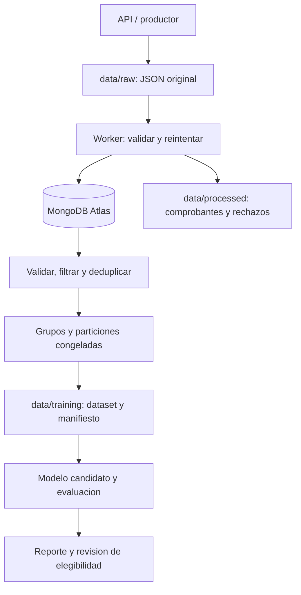

# Auditoria duradera y preparacion de entrenamiento

## Alcance y limites

La API conserva sus contratos `audio` y `audio_base64`, y sigue usando el modelo de
`app/model.py`. El pipeline de auditoria es independiente de MongoDB y del entrenamiento.
No se cambia el artefacto servido ni se realiza promocion automatica.

La ruta nueva de entrenamiento es un **experimento de telemetria medida** con siete
variables, explicitamente incompatible con el modelo por intervenciones servido por la
API. Sustituye el antiguo script que entrenaba con valores inventados y sobrescribia
`classifier_latest.pkl`. La API actual produce decisiones y turnos, pero no todas esas
siete variables, etiquetas verificadas ni identidades de hablante. Por eso sus eventos
no quedan listos para entrenar por el mero hecho de haber sido ingeridos.

Para reentrenar el modelo de produccion faltan una fuente de audio privado autorizada,
su resolucion a muestras y la conexion con `app/interventions.py` y los entrenadores
existentes de `scripts/train_issue5.py` / `train_issue11.py`. No adaptar el modelo servido
al vector experimental de siete variables. Los scripts historicos son herramientas de
investigacion; algunos escriben el artefacto configurado y no deben programarse como jobs
de produccion sin aislar primero su salida.

## Responsabilidades

| Modulo | Responsabilidad |
| --- | --- |
| `app/main.py`, `app/audit.py` | Inferencia y publicacion duradera del evento |
| `src/config.py` | Variables de entorno tipadas; sin I/O al importar |
| `src/schemas.py` | Contrato de documento, segmentos, decisiones y etiquetas |
| `src/storage.py` | Escritura atomica, fsync y bloqueo local entre procesos |
| `src/db.py` | Ciclo de vida del cliente y configuracion de timeouts |
| `src/repositories.py` | Indices, persistencia idempotente y lectura del corpus |
| `src/worker.py` | Polling, validacion, reintentos y comprobantes |
| `src/migrate_audit.py` | Conversion explicita de JSONL historico |
| `src/data_processing.py` | Filtrado, deduplicacion, features y particiones |
| `src/export_training.py` | Snapshots reproducibles y registro de particiones |
| `src/retrain_pipeline.py` | Candidatos, metricas, procedencia y criterio de elegibilidad |
| `src/weekly.py` | Una ejecucion del ciclo, invocada por un scheduler externo |
| `tests/test_pipeline*.py` | Pruebas sin Atlas |
| `tests/test_mongo_integration.py` | Integracion optativa con servidor desechable |

No se introducen carpetas vacias application/domain/services: las responsabilidades
estan separadas en modulos dentro de la estructura existente.



## Configuracion y ejecucion

Usar Python 3.14, como CI y Docker. El worker solo requiere
`pip install -r requirements-worker.txt`; la API y los tests usan
`pip install -r requirements-dev.txt`. En Windows, construir `webrtcvad-wheels` en
Python 3.14 requiere Microsoft C++ Build Tools. El Dockerfile Linux ya instala gcc
en su etapa de build. No cambiar versiones del entorno de produccion para esquivar
esta dependencia de compilacion.

Copiar `.env.example` a `.env` y completar los valores localmente. Los comandos de
pipeline cargan `.env` solo al ejecutarse como CLI; importar un modulo no abre MongoDB.
Para API local usar `uvicorn app.main:app --env-file .env`; Compose inyecta el entorno.

| Variable | Default / proposito |
| --- | --- |
| `MONGODB_URI` | Vacia; obligatoria para comandos de base de datos |
| `AUDIT_ID_KEY` | Clave privada para HMAC de IDs externos; vacia desactiva correlacion |
| `MONGODB_DATABASE` | `altur_defense` |
| `MONGODB_COLLECTION` | `calls_v1`; coleccion nueva para evitar mezclar contratos antiguos |
| `MONGODB_TIMEOUT_MS` | `5000`; operacion, seleccion de servidor, conexion y socket |
| `AUDIT_SPOOL_DIR` | `data/raw` |
| `PROCESSED_DIR` | `data/processed` |
| `TRAINING_DIR` | `data/training` |
| `MODEL_DIR` | `model/candidates`; NO es `MODEL_PATH` de la API |
| `WORKER_POLL_SECONDS` | `2` |
| `WORKER_RETRY_ATTEMPTS` | `3` por ciclo |
| `WORKER_RETRY_SECONDS` | `1`; backoff exponencial entre intentos |
| `WORKER_BATCH_SIZE` | `100` |
| `MAX_JSON_BYTES` | `1048576` |
| `ENVIRONMENT`, `LOG_LEVEL` | `development`, `INFO` |
| `MODEL_VERSION`, `PIPELINE_VERSION` | `unknown`, `audit-v1`; la API pasa la version cargada |

El `.env` del equipo usa `MONGO_URI`, `MONGO_DB` y `COLLECTION_CALLS`; tambien se aceptan
`DATABASE_NAME` y `COLLECTION_NAME`. Las variables `MONGODB_*` prevalecen si ambas existen,
incluso cuando estan vacias.

`AUDIT_LOG_PATH` deja de ser el destino de la API: la API publica en la bandeja
(`AUDIT_SPOOL_DIR`) y `python -m src.migrate_audit` lee ese JSONL heredado cuando se ejecuta
sin argumentos.

La coleccion puede contener documentos del auditor anterior. No se modifican: el indice unico
de `event_id` es parcial (solo documentos con `event_id`) y la exportacion de entrenamiento
lee unicamente `schema_version: 1`.

Si la coleccion ya tiene un indice `call_id_1` **unico** (el auditor anterior lo creaba), el
worker lo respeta y registra `event=index_kept` en lugar de abortar. Sin `AUDIT_ID_KEY` no
hay problema: cada evento usa su propio `event_id` como `call_id`. Con `AUDIT_ID_KEY`, dos
peticiones con el mismo `call_id` producen el mismo HMAC y la segunda queda en
`data/processed/rejected/` por conflicto. Para correlacionar llamadas repetidas hay que
retirar antes ese indice unico (`db.calls.dropIndex("call_id_1")`); el worker lo recrea sin
`unique`.

```bash
python -m src.worker                 # bucle de polling
python -m src.worker --once          # un lote; salida no cero si falla infraestructura
python -m src.migrate_audit data/audit.jsonl
python -m src.export_training --until 2026-09-14T00:00:00+00:00
python -m src.retrain_pipeline data/training/ID/dataset.json
python -m src.retrain_pipeline data/training/ID/dataset.json --baseline model/candidates/RUN/candidate.joblib
python -m src.weekly
```

`scripts/export_retrain_data.py` es ahora una entrada compatible al exportador. Ya no
inserta una llamada de demostracion en Atlas cuando se ejecuta o importa.

## Worker y recuperacion

Se eligio polling sobre disco local porque el despliegue actual es una VM con Compose.
Una cola externa agregaria infraestructura sin resolver la necesidad inicial de
persistir el evento antes de confirmar la peticion. La API escribe un archivo temporal,
hace flush/fsync y publica mediante rename atomico en el mismo filesystem; el worker
solo lee archivos terminados `*.json`. La API espera esa publicacion en un hilo, fuera
del event loop. Si no puede conservarla, registra `event=audit_failed` y responde igual:
la deteccion es el contrato y no debe caer por un disco lleno o un volumen sin permisos.
Con `AUDIT_REQUIRED=true` se exige la auditoria y la API responde 503 si falla.

Semantica **al menos una vez**: el JSON original se conserva incluso despues de guardar.
`data/processed/receipts/` contiene el estado, fecha, hash original y documento normalizado.
Un fallo despues de insertar pero antes del comprobante repite una operacion idempotente.
El `_id` de MongoDB es `event_id`, y `$setOnInsert` impide que un replay restablezca
etiquetas o estados corregidos. Un mismo ID con contenido diferente se rechaza.

Errores de conectividad se reintentan con backoff. Al agotarse, el archivo sigue pendiente
para el siguiente ciclo/reinicio. Errores de autenticacion/indices/escritura tampoco
eliminan originales: requieren corregir configuracion. JSON invalidos y conflictos de ID
dejan un comprobante en `data/processed/rejected/`, sin bloquear los siguientes JSON.
Para corregir un rechazo, producir un nuevo evento con ID nuevo, conservando el original.
Para repetir un evento valido ya confirmado, retirar SOLO su comprobante despues de
revisarlo; la persistencia idempotente evita duplicarlo. No editar archivos RAW publicados.

Un bloqueo de sistema operativo impide dos consumidores simultaneos de la misma bandeja.
Se libera al cerrar o morir el proceso, sin leases que recuperar. **Solo disco local**,
un host y directorios compartidos coherentes: no usar esta implementacion sobre NFS ni
como cola distribuida. Los productores pueden publicar concurrentemente con IDs UUID.
La deduplicacion de solicitudes HTTP repetidas no es el contrato del worker: solicitudes
separadas tienen eventos separados; la huella de audio evita duplicarlas en entrenamiento.

En Linux, el bind mount `./data` debe existir y ser escribible por UID/GID `10001:10001`;
`deploy/arrancar.sh` lo crea con ese dueno antes de levantar el compose.
API y worker usan el mismo UID. El chown del Dockerfile no cambia permisos de un bind mount
del host. Probar esto antes de desplegar. La confirmacion local no protege contra perdida
fisica del disco: hacen falta backup y monitorizacion de espacio. No se purga RAW
automaticamente; crecimiento y politica de retencion son tareas operativas pendientes.
Con volumen alto, sustituir el escaneo de archivos por una cola duradera o indice local.

## MongoDB Atlas

Configurar un usuario de servicio con permisos acotados a la base y las IPs del despliegue.
Utilizar la URI Atlas `mongodb+srv` generada por el servicio, desde el entorno, sin
deshabilitar TLS ni validacion de certificados. No incluir URIs reales en ejemplos o logs.
El cliente se reutiliza con lock; un ping fallido cierra el candidato antes de permitir
otro intento. Los entrypoints cierran el cliente en `finally`.

Se usan timeouts finitos, `retryWrites=True` y write concern `majority`. El worker solo
confirma tras la respuesta de persistencia. Los indices cubren `event_id` unico, `call_id`,
estado/fecha y huella de audio. Fallar al crear indices impide continuar silenciosamente.
La validacion Pydantic se aplica tambien en el repository; escrituras externas directas
a MongoDB deben respetar el contrato (no se instala un validador administrativo de
coleccion automaticamente). Antes de reutilizar una coleccion antigua, revisar sus
indices: un indice unico heredado sobre `call_id` impediria varios eventos por llamada.

La separacion entre etiqueta y prediccion debe conservarse al implementar el servicio
de revision humana. Una etiqueta verificada necesita procedencia. Las predicciones del
modelo y los valores historicos fabricados nunca son ground truth.

## JSON version 1

```json
{
  "schema_version": 1,
  "event_id": "event-opaque-001",
  "call_id": "call-opaque-001",
  "timestamp": "2026-09-13T12:00:00Z",
  "source": "detect-api",
  "model_version": "issue5-interventions-v1",
  "pipeline_version": "audit-v1",
  "group_ids": [],
  "decision": {
    "is_synthetic": false,
    "confidence": 0.95,
    "probability_synthetic": 0.05
  },
  "analysis": {
    "stage": "first_turn",
    "latency_s": 0.28,
    "audio_duration_s": 12,
    "turns": [{"channel": 0, "start": 0.5, "end": 2.8}]
  },
  "quality": "unknown",
  "status_for_training": "unlabeled"
}
```

Obligatorios: IDs, fecha con zona, origen, decision y analisis. Se rechazan versiones
desconocidas, campos no declarados, NaN/infinito, probabilidades fuera de rango y turnos
invertidos o fuera de la duracion. Opcionales: huella SHA256 de PCM, referencia privada
`s3://` sin tokens, parametros, errores categorizados, metadatos y etiqueta verificada.
Una etiqueta tiene `value` human/synthetic, `provenance` opaca y `verified`.
`ready` exige etiqueta verificada y calidad aceptada; el dataset exige ademas identidad,
huella, una intervencion del llamante (canal 0) de al menos un segundo y features medidas.

No se almacena audio base64, transcripcion, nombres, telefono ni credenciales desde la API.
El ID de llamada externo se resume con HMAC-SHA256 cuando se configura `AUDIT_ID_KEY`;
sin clave se usa el ID del evento y se omite correlacion entre peticiones. Es
seudonimizacion, no anonimato. Conservar la clave fuera del repositorio y planificar
su rotacion: cambiarla rompe correlacion historica. Los productores deben enviar IDs opacos,
y `group_ids` debe contener todas las relaciones conocidas (hablante, sesion, fuente/voz),
con prefijos estables compartidos entre origenes. No usar el nombre de un dataset completo
como identidad de hablante. Los diccionarios de metadatos son para productores confiables;
su contenido requiere una politica de minimizacion antes de incorporar fuentes nuevas.

## Dataset y ausencia de fuga

RAW conserva entradas originales; PROCESSED guarda comprobantes y normalizacion;
TRAINING guarda snapshots por hash con filas, distribucion, exclusiones y manifiesto.
Se consulta el corpus historico hasta un cutoff, incluyendo registros sin etiqueta que
puedan conectar identidades. No se entrena solo con la ultima semana: hacerlo perderia
relaciones historicas y favoreceria olvido. El exportador carga actualmente el corpus
en memoria; para grandes volumenes se necesitara procesamiento por lotes/almacen externo.

Antes de filtrar y deduplicar se unen transitivamente llamada, grupos y huella de audio.
Las componentes completas reciben train/validation/test mediante hash con semilla 57,
en proporciones esperadas 70/15/15. No se promete estratificacion exacta; si faltan clases
o datos, entrenamiento falla en vez de dividir muestras relacionadas para forzar cupos.
`split_registry.json` congela las asignaciones entre semanas. Una relacion nueva que une
particiones previamente diferentes provoca error y requiere reconstruir/revisar el
benchmark y sus modelos. Conservar el registro junto con los datasets y sus backups.

Escalado se ajusta exclusivamente en train dentro de un Pipeline sklearn. Validation
es la particion del criterio de elegibilidad; test es solo reporte final y no se usa
para seleccionar umbrales. No ajustar hiperparametros repetidamente mirando test; para
evaluacion semanal prolongada incorporar holdouts nuevos y revisar deriva temporal.
Si no se conocen identidades entre dos muestras, ningun algoritmo puede garantizar
ausencia de fuga por hablante. El agrupamiento MFCC historico es aproximado, no identidad
certificada; se conserva documentado en `scripts/speaker_groups.py`.

## Reentrenamiento y promocion

Programar `python -m src.weekly` con systemd timer/cron o Windows Task Scheduler,
por ejemplo lunes 03:00, desde la raiz del proyecto y con el entorno correcto.
No se instala ni activa un scheduler en esta revision. Hay un lock contra ejecuciones
solapadas; fallos dan codigo no cero y no marcan muestras como entrenadas.

Cada ejecucion genera un candidato aislado y reporte con version, fecha, dataset/hash,
distribucion, hiperparametros, version sklearn/pipeline, commit, estado dirty y hash del
codigo fuente, metricas AUC/Brier/FPR/FNR/balanced accuracy y hash del artefacto.
Un directorio sin `report.json` es una ejecucion incompleta y no es promocionable.

El gate provisional requiere AUC validation >= 0.90, FPR <= 0.05, mejora AUC >= 0.005
contra baseline sin empeorar Brier o FPR, metricas finitas y contrato compatible.
Estos umbrales son una politica inicial pendiente de validacion estadistica y de negocio,
no evidencia de calidad con datos reales. El baseline debe usar las mismas features y
el mismo dataset congelado. Solo cargar artefactos joblib locales de confianza.

La incompatibilidad actual con el modelo de API mantiene la promocion bloqueada incluso
si el candidato supera metricas. No hay escritura sobre `model/model.joblib`, `MODEL_PATH`
ni `classifier_latest.pkl`. Al conectar entrenamiento de produccion, exigir tambien
evaluacion agrupada, stress, intervalos de confianza, muestra minima por clase y revision
humana; luego implementar una promocion atomica, auditable y reversible.

## Pruebas y operacion

```bash
pytest -q
ruff check src app tests scripts analysis
pytest -q tests/test_pipeline.py
pytest -q -m integration tests/test_mongo_integration.py
```

La ultima orden omite integracion si no existe `MONGODB_TEST_URI`. Usar exclusivamente
un servidor desechable: crea y elimina una base aleatoria `altur_test_*`. Nunca usa
`MONGODB_URI` de produccion. Los unit tests usan fakes, mocks y directorios temporales;
la API tampoco escribe en la bandeja real durante pytest. No hay type checker configurado
en el repositorio; lint, validacion de schemas e imports no equivalen a analisis estatico
de tipos completo.

Monitorizar errores `validation_failed`, `id_conflict`, `database_failed`, `retry`,
`audit_failed`, numero de pendientes, antiguedad del mas viejo, rechazos y disco disponible.
Los logs incluyen evento, documento, intento, tiempo y resultado sin cuerpos ni URI.
No hay aun exportador Prometheus ni alertas instaladas.

Referencias de diseno: [timeouts y conexion PyMongo](https://www.mongodb.com/docs/languages/python/pymongo-driver/current/connect/),
[prevencion de data leakage con sklearn](https://scikit-learn.org/stable/common_pitfalls.html).
